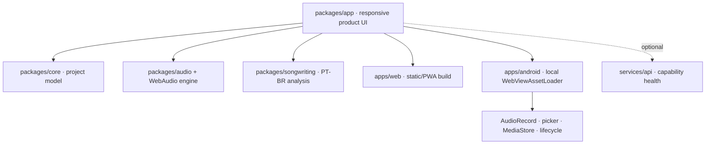

# Canonical architecture

Web and Android execute the same HTML, CSS, JavaScript, project schema, audio graph, persistence abstraction, presets, songwriting logic, and export encoder. Android packages the canonical `packages/` tree as local assets and exposes only native adapters through `PabloVoiceAndroid`.

## Local data path

1. Import or recording produces a real `Blob`.
2. WebAudio decodes it before a track is accepted.
3. The original blob is stored in IndexedDB; edits remain metadata.
4. Preview creates a live graph from trim, gain, pan, filters and Voice Lab settings.
5. A/B reconstructs that graph with processing bypassed or enabled.
6. Export uses `OfflineAudioContext`, mixes audible tracks, normalizes to a preset peak, then writes PCM16 WAV.

## Capability boundary

The local app never requires authentication or a server to boot. `/api/health` describes optional cloud capability state. Generative AI, stems and voice conversion remain unavailable until a protected provider implements the contract and passes its own functional gates.

